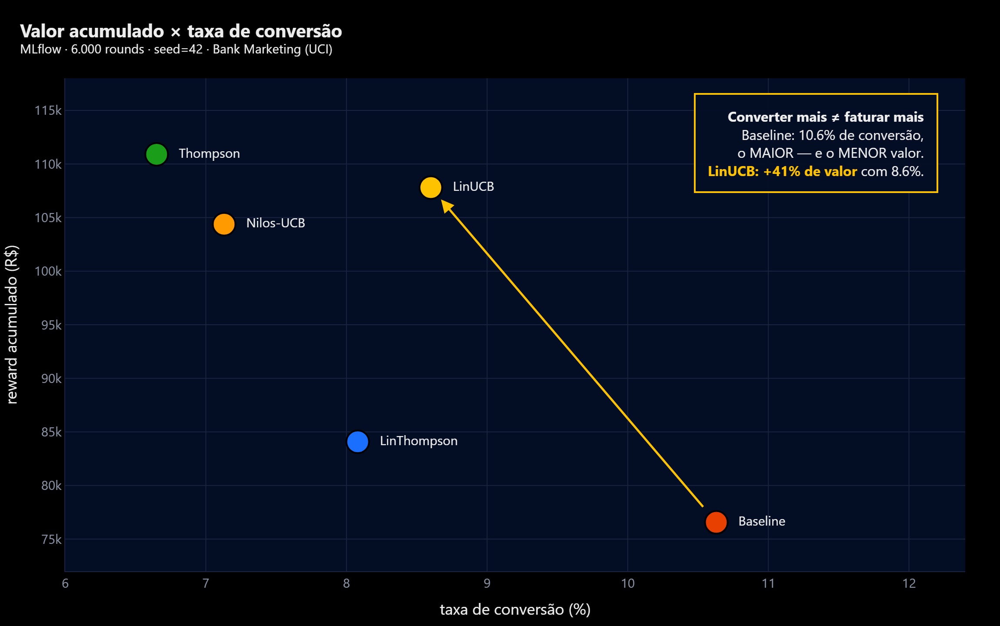

<div align="center">

# 🎯 Adaptive Offers Platform

### Plataforma de experimentação adaptativa para ofertas financeiras com *multi-armed bandits*

*Decide, em canais digitais de uma instituição financeira, **qual oferta / mensagem / próximo passo** apresentar a cada cliente elegível — equilibrando exploração e explotação em vez de regras fixas ou testes A/B longos.*

**FIAP Pós-Tech `7MLET` · Fase 05 · Datathon · Grupo 74**

<br/>

[](https://github.com/dionebraga/datathon-7mlet-grupo-74/actions/workflows/ci.yml)
[](tests/)
[](https://docs.astral.sh/ruff/)
[](LICENSE)
[](pyproject.toml)

<br/>

**Stack**


</div>

---

## 📑 Índice

| | | |
|---|---|---|
| [1. Visão do problema](#1-visão-do-problema) | [4. 🚀 Como rodar (PowerShell)](#4--como-rodar-no-windows--powershell) | [7. 📚 Documentação](#7--documentação) |
| [2. Escopo e design](#2-escopo-e-escolhas-de-design) | [5. 👀 Como visualizar](#5--como-visualizar) | [8. ⚠️ Limitações](#8--limitações-conhecidas) |
| [3. 🗂️ Mapa de pastas](#3-️-mapa-de-pastas) | [6. 🧪 Comandos](#6--comandos-pipeline-ponta-a-ponta) | [9. 🏁 Resultados](#9--resultados-principais) |

---

## 1. Visão do problema

Uma instituição financeira digital precisa decidir, em diferentes canais (app,
e-mail, push, SMS), **qual oferta apresentar** a cada cliente elegível. Regras
fixas e testes A/B longos **desperdiçam tráfego**, demoram a reagir a mudanças de
contexto e dificultam a personalização responsável.

Modelamos isso como um **multi-armed bandit contextual**: cada "braço" é uma
oferta; o "contexto" é o estado anonimizado do cliente/canal; a "recompensa" é a
conversão observada (muitas vezes **atrasada**). O sistema **equilibra exploração
e explotação**, aprende com respostas observadas e **nunca congela** a decisão em
regras estáticas. Um **assistente com LLM + RAG** resume experimentos, recupera
políticas comerciais internas (sintéticas) e explica cada decisão.

> ⚠️ **Não é um sistema bancário real.** Usamos uma base Kaggle factual como
> referência e construímos uma **camada sintética** por cima. Nenhum dado real de
> cliente, identificador, renda, patrimônio, gênero ou raça é utilizado. Decisões
> sensíveis mantêm **humano no loop** (ver [`docs/lgpd-plan.md`](docs/lgpd-plan.md)).

## 2. Escopo e escolhas de design

| Decisão | Escolha | Por quê |
|---|---|---|
| 🧠 Formulação | Multi-armed bandit contextual | Equilibra exploração/explotação sem A/B longos |
| 🎰 Algoritmos | Baseline · Thompson · Nilos-UCB · LinUCB · **Neural (PyTorch)** | Não-contextual (TS/UCB), contextual linear (LinUCB) e **deep bandit** (MC-dropout) |
| 📊 Base factual | **[Bank Marketing — Kaggle](https://www.kaggle.com/datasets/henriqueyamahata/bank-marketing)** (`henriqueyamahata` · UCI, Moro et al. 2014 · 41.188 linhas · CC BY 4.0) — detalhes em [`data/kaggle/README.md`](data/kaggle/README.md) | Propensão/conversão bancária, licença aberta |
| 🚫 Vazamento | `duration` e colunas pós-contato **descartadas** | Evitar *target leakage* (Stage 1) |
| ⏳ Recompensa atrasada | Modelada no enriquecimento sintético | Realismo de canais digitais |
| 🗄️ Feature Store | Offline (Parquet) + Online (SQLite) versionado | Consistência treino/serving, baixa latência |
| 🌐 Serving | FastAPI + CLI, log de decisão auditável | Contrato claro, reason codes, versão de política |
| 🧭 Orquestração fintech | Segmentação · multi-canal · Next-Best-Action · IA responsável | Decide *oferta + mensagem + canal + próximo passo* e audita fairness por grupo |
| 🤖 Assistente | RAG sobre políticas sintéticas + LLM plugável (offline por padrão) | Roda sem chave de API; pronto p/ Azure OpenAI/Claude |
| 📈 Tracking | MLflow | Rastreio de experimentos e métricas |
| ☁️ Nuvem-alvo | **Azure** (Key Vault, Managed Identity, App Insights…) | Requisito da Fase 05 |

## 3. 🗂️ Mapa de pastas

```
datathon-7mlet-grupo-74/
├── 📄 README.md · pyproject.toml · .env.example · .gitignore · LICENSE · Makefile
├── 🐳 Dockerfile · docker-compose.yml
├── ⚙️  .github/workflows/        # CI (lint+test) e CD (build/publish imagem)
├── 📦 data/
│   ├── kaggle/README.md          # fonte, link, versão, licença da base factual
│   ├── processed/                # base tratada SEM vazamento (gerada)
│   ├── synthetic_enrichment/      # offer_catalog, offer_events, delayed_rewards (gerada)
│   └── golden_set/evaluation_cases.jsonl  # >= 20 casos versionados
├── 📖 docs/                       # arquitetura Azure, model/system card, LGPD, feature store
├── 📝 reports/                    # data-generation, relatório técnico, EDA, avaliação
├── 📓 notebooks/                  # EDA executável
├── 🧩 src/adaptive_offers/        # pacote Python (lib + API + CLI)
│   ├── data/ · feature_store/ · bandits/ · simulation/ · evaluation/
│   ├── policy/ · assistant/ · monitoring/ · api/ · cli.py
│   ├── segmentation.py            # personas comportamentais (6 segmentos)
│   ├── channels.py                # catálogo de canais + política de contato
│   ├── nba.py                     # Next-Best-Action (oferta→mensagem→passo)
│   └── responsible.py             # atributos protegidos + fairness por grupo
├── 📊 dashboard/                  # BI (Streamlit)
├── 🎨 frontend/                   # Console de decisão (Next.js + Tailwind v4 — bônus, consome a API)
└── ✅ tests/                      # unit/ + integration/ (95 testes)
```

### 📈 Como ler o histórico de commits

O trabalho foi feito em **sprints focados** (não um commit por dia), com **100+
commits** que mostram a **evolução real** — não um único commit final (Etapa 0).

- **Padrão `stage-0` … `stage-8`**: os commits iniciais seguem as etapas do edital
  (organização → base/EDA → enriquecimento → baseline/algoritmos → avaliação →
  serviço → Azure → MLOps → governança), evidenciando a construção incremental.
- **Branch de features + merge**: as 4 camadas fintech e o rebranding foram
  desenvolvidos em `feat/branding-logo-llm-ui` e integrados à `main` por um
  **merge commit** (`--no-ff`) — a feature aparece como uma unidade revisável,
  coerente com o *approval gate* que o projeto documenta (Etapa 7).
- **Intervalos entre datas** refletem pausas naturais entre sprints; a densidade
  de commits (30 no primeiro dia, dezenas depois) demonstra trabalho contínuo e
  rastreável, não um *dump* final.

## 4. 🚀 Como rodar no Windows / PowerShell

> Pré-requisitos: **Python 3.11+** e **git**. (Opcional: Docker, conta Kaggle.)
> Todos os comandos abaixo são **PowerShell** (testados no Windows 11).

```powershell
# 1) Clonar
git clone https://github.com/dionebraga/datathon-7mlet-grupo-74.git
cd datathon-7mlet-grupo-74

# 2) Ambiente virtual
python -m venv .venv
.\.venv\Scripts\Activate.ps1
#  ↳ se bloquear por política de execução, rode uma vez:
#    Set-ExecutionPolicy -Scope Process -ExecutionPolicy Bypass

# 3) Instalar o pacote + ferramentas de dev + dashboard
pip install -e ".[dev,bi]"
Copy-Item .env.example .env      # roda sem editar

# 4) Pipeline completo (dados → enriquecimento → treino → avaliação)
adaptive-offers pipeline

# 5) Uma decisão de exemplo (saída JSON limpa, pipeável)
adaptive-offers decide --context examples\context_sample.json
adaptive-offers decide --context examples\context_sample.json | ConvertFrom-Json
```

> 💡 Sem credenciais Kaggle? O loader usa um **gerador determinístico** que
> reproduz o *schema* da base Bank Marketing para que **todo o pipeline rode
> offline**. Para baixar a base real, veja [`data/kaggle/README.md`](data/kaggle/README.md).

<details>
<summary>🐧 Linux / macOS (bash) e 🐳 Docker</summary>

```bash
python -m venv .venv && source .venv/bin/activate
pip install -e ".[dev,bi]"
cp .env.example .env
make pipeline        # atalhos do Makefile (Linux/macOS)
make test
```

```bash
# Stack completa (API + MLflow + dashboard) em containers
docker compose up --build
```
> No Windows, o `make` não existe por padrão — use os comandos `adaptive-offers ...`
> e `pytest`/`streamlit` diretamente (Seção 6). O Docker funciona igual.
</details>

## 5. 👀 Como visualizar

> 🚀 **Subir tudo de uma vez** (API + MLflow + Dashboard, em janelas separadas):
> `.\start.ps1` · para encerrar: `.\stop.ps1`
> 👉 Nunca rodou o projeto? Siga o [**COMECE-AQUI.md**](COMECE-AQUI.md) (do zero até as 4 telas no ar).

| O quê | Comando (PowerShell) | Abrir em |
|---|---|---|
| 🌐 **API + Swagger** (docs interativa) | `adaptive-offers serve` | http://localhost:8000/docs |
| 📊 **Dashboard BI** (comparação, regret, decisão) | `streamlit run dashboard\app.py --server.port 8503` | http://localhost:8503 |
| 📈 **MLflow** (experimentos) | `$env:MLFLOW_ALLOW_FILE_STORE='true'; mlflow ui --backend-store-uri file:./mlruns --port 5001` | http://localhost:5001 |
| 🎨 **Decision Console** (Next.js, bônus) | `cd frontend; npm install; npm run dev` | http://localhost:3000 |
| 🧾 **Log auditável de decisões** | `Get-Content artifacts\decisions\audit.jsonl -Tail 5` | terminal |
| 📓 **Notebook de EDA** | `jupyter lab notebooks\01_eda.ipynb` | navegador |

> ⚠️ As portas **5001** (MLflow) e **8503** (dashboard) não são as padrão: a 5000 e
> a 8501 colidem com outros serviços comuns no Windows. `start.ps1` já usa as
> corretas — se abrir a porta errada, você verá uma página em branco ou de outro app.

### 5.1 📈 MLflow — 6 formas de acessar os experimentos

Os **19 runs** (1 por política × seeds) ficam em `mlruns/`, no *file store* local.
Guia completo com filtros, comparações e troubleshooting:
[**docs/mlflow-guia.md**](docs/mlflow-guia.md).

```powershell
# 1) UI web — a forma da demo. Espere ~15–40 s pelo "Uvicorn running".
$env:MLFLOW_ALLOW_FILE_STORE='true'
mlflow ui --backend-store-uri file:./mlruns --registry-store-uri file:./mlruns --port 5001
#  ↳ na UI, clique na aba "Model training" (NÃO em "GenAI") → Runs

# 2) Duplo-clique (sem terminal): VER-MLFLOW.bat, na pasta acima do projeto

# 3) Tabela dos runs no terminal — instantâneo, sem subir servidor nenhum
python scripts\mlflow_report.py                 # todos os runs, ordenados por reward
python scripts\mlflow_report.py --compare       # melhor run de CADA política (vai ao pitch)
python scripts\mlflow_report.py --policy linucb # filtra uma política
python scripts\mlflow_report.py --top 3         # os 3 melhores
python scripts\mlflow_report.py --run-id <id>   # todos os params/métricas de um run

# 4) API Python direta (aspas simples por fora: o PowerShell não escapa aspas duplas aninhadas)
python -c 'import mlflow; mlflow.set_tracking_uri("file:./mlruns"); print(mlflow.search_runs(experiment_names=["adaptive-offers"]).shape[0], "runs")'

# 5) Reproduzir um run e vê-lo aparecer na UI ao vivo (bom momento de gravação)
adaptive-offers train-all --horizon 6000        # 1 run por política, tudo logado no MLflow

# 6) Docker (stack inteira, MLflow incluso)
docker compose up --build
```

> 📈 **Na UI, use a aba `Model training`** (topo, ao lado de `GenAI`) para ver os
> runs, métricas e a comparação de políticas. A visão `GenAI` (Overview/Traces) é de
> LLM e exige backend SQL — fica **vazia** com o *file store*, o que é esperado.
> A aba **Artifacts** de cada run também fica vazia: registramos **params, métricas
> e tags** (o modelo serializado vive em `artifacts/policies/`, versionado pelo
> registry próprio em `artifacts/policies/registry.json`).

**Testar a API com PowerShell** (com o `serve` rodando em outra janela):

```powershell
# Decisão para um cliente sênior com sucesso prévio
$body = @{ age = 66; contact = "cellular"; poutcome = "success"; euribor3m = 0.8 } | ConvertTo-Json
Invoke-RestMethod -Uri http://localhost:8000/decide -Method Post -Body $body -ContentType "application/json"

# Explicação da decisão (assistente LLM/RAG)
Invoke-RestMethod -Uri "http://localhost:8000/assistant/explain?question=Por que essa oferta?" `
  -Method Post -Body $body -ContentType "application/json"
```

### 5.1 🤖 Assistente LLM — ativar Claude (Anthropic) ou Azure OpenAI

O assistente funciona em **três modos**, selecionados pela variável `LLM_PROVIDER`
no arquivo `.env` (na raiz do projeto). Sem chave, ele cai automaticamente no modo
**offline** (resumo determinístico, ainda *grounded* nos chunks RAG) — por isso o
badge mostra **⚡ análise ML**.

| `LLM_PROVIDER` | Requisito | Badge no dashboard |
|---|---|---|
| `offline` (padrão) | nenhum | ⚡ análise ML |
| `anthropic` | `ANTHROPIC_API_KEY` | ● Claude online |
| `azure_openai` | `AZURE_OPENAI_*` | ● Claude online |

**Ativar o Claude (Anthropic):** edite o `.env` e reinicie API + dashboard:

```dotenv
LLM_PROVIDER=anthropic
ANTHROPIC_API_KEY=sk-ant-api03-...        # console.anthropic.com/settings/keys
ANTHROPIC_MODEL=claude-opus-4-8           # qualidade máxima (ou claude-haiku-4-5 p/ custo)
```

> ⚠️ O `.env` está no `.gitignore` — **nunca** faça commit da chave. Se ela vazar,
> revogue em *console.anthropic.com → API keys* e gere outra.
> A chave é lida **só na inicialização**: depois de editar o `.env`, **reinicie**
> o `streamlit run` (e o `adaptive-offers serve`) para o badge virar **● Claude online**.

## 6. 🧪 Comandos (pipeline ponta a ponta)

| Comando | Stage | O que entrega |
|---|:---:|---|
| `adaptive-offers data build` | 1 | Base processada, registro de fonte/versão/licença, decisão de vazamento |
| `adaptive-offers synth generate` | 2 | `offer_catalog`, `offer_events`, `delayed_rewards` + schema |
| `adaptive-offers train --horizon 20000 --seed 42` | 3 | Treina **uma** política e registra como ativa, métricas em MLflow |
| `adaptive-offers train-all --horizon 20000` | 3 | Treina **as 5 políticas** (1 run cada no MLflow) p/ comparação; registra LinUCB como ativa |
| `adaptive-offers evaluate --horizon 20000 --seed 42` | 4 | Métricas reproduzíveis, golden set, fairness de exposição |
| `adaptive-offers ope --policy linucb --incumbent baseline` | 4/7 | **Off-policy Doubly Robust** (IPS/SNIPS/DM/DR + IC) + gate de promoção |
| `adaptive-offers decide` | 5 | Decisão com braço, reason codes, versão da política, log auditável |
| `adaptive-offers serve` | 5 | API com contrato documentado e tratamento de erro |
| `adaptive-offers monitor` | 7 | Relatório HTML de drift/fairness (EvidentlyAI opcional) |
| `adaptive-offers pipeline --rows 20000` | 1–4 | **Tudo em um comando** (28s) |
| `pytest` | — | 95 testes (unit + integração) |

## 7. 📚 Documentação

| 📄 Documento | Conteúdo |
|---|---|
| [**ACESSOS.md**](ACESSOS.md) | 🔗 **Todos os links, portas e endpoints** — o mapa de acesso do projeto |
| [**COMECE-AQUI.md**](COMECE-AQUI.md) | 🚀 **Do zero até as 4 telas no ar** — instalação, pipeline, portas e troubleshooting |
| [docs/mlflow-guia.md](docs/mlflow-guia.md) | 📈 6 formas de acessar o MLflow + troubleshooting |
| [docs/architecture-azure.md](docs/architecture-azure.md) | ☁️ Arquitetura-alvo Azure (Mermaid, serviços, FinOps) |
| [docs/feature-store.md](docs/feature-store.md) | 🗄️ Feature Store offline/online |
| [docs/mlops-lifecycle.md](docs/mlops-lifecycle.md) | 🔁 Ciclo MLOps (MLflow, drift, promote/rollback) |
| [docs/model-card.md](docs/model-card.md) | 🪪 Model Card |
| [docs/system-card.md](docs/system-card.md) | 🛡️ System Card (riscos, guardrails) |
| [docs/lgpd-plan.md](docs/lgpd-plan.md) | 🔒 Plano LGPD |
| [docs/roadmap-improvements.md](docs/roadmap-improvements.md) | 🧭 Roadmap de evoluções (Typer, DVC, Prefect, EvidentlyAI, deep bandits) |
| [reports/technical-report.md](reports/technical-report.md) | 📑 Relatório técnico (≤10 páginas) |
| [reports/algorithmic-strategy.md](reports/algorithmic-strategy.md) | 🎰 Estratégia algorítmica + comparação |
| [reports/offline-evaluation.md](reports/offline-evaluation.md) | 📏 Avaliação offline + golden set + fairness |
| [reports/data-generation.md](reports/data-generation.md) | 🧬 Geração de dados sintéticos |

### Mapa Datathon → entregáveis (Etapas 0–8)

| Etapa | Onde está |
|:---:|---|
| 0️⃣ Organização | README, `pyproject.toml`, `.env.example`, `.gitignore`, histórico de commits |
| 1️⃣ Kaggle + EDA | [`data/kaggle/`](data/kaggle/README.md), [`notebooks/`](notebooks/), `src/.../data/` |
| 2️⃣ Enriquecimento | `src/.../data/synthetic.py`, [`reports/data-generation.md`](reports/data-generation.md) |
| 3️⃣ Baseline + algoritmos | `src/.../bandits/`, `src/.../simulation/` |
| 4️⃣ Avaliação + golden set | `src/.../evaluation/`, `data/golden_set/` |
| 5️⃣ Serviço demonstrável | `src/.../api/`, `src/.../policy/`, `tests/` |
| 6️⃣ Arquitetura Azure | [`docs/architecture-azure.md`](docs/architecture-azure.md) |
| 7️⃣ Ciclo MLOps | [`docs/mlops-lifecycle.md`](docs/mlops-lifecycle.md), `src/.../monitoring/` |
| 8️⃣ Governança | [`docs/model-card.md`](docs/model-card.md), [`docs/system-card.md`](docs/system-card.md), [`docs/lgpd-plan.md`](docs/lgpd-plan.md) |

## 8. ⚠️ Limitações conhecidas

- **Base sintética**: o gerador offline reproduz o *schema* do Bank Marketing
  para reprodutibilidade em CI, mas **não substitui** a base real para conclusões
  de negócio.
- **Recompensa simulada**: conversões e *delayed rewards* são gerados por um
  modelo probabilístico documentado — servem para comparar políticas, não para
  estimar *lift* real.
- **LLM offline por padrão**: sem chave de API, o assistente usa um sumarizador
  determinístico (sem alucinação). A qualidade melhora com Claude/Azure OpenAI.
- **Sem prontidão regulatória**: protótipo acadêmico. **Não** está pronto para
  produção financeira regulada (ver [`docs/system-card.md`](docs/system-card.md)).

## 9. 🏁 Resultados principais

Base **real** (UCI Bank Marketing, 41.188 contatos · `provenance="real"`), 6.000
rounds, 40% de recompensa atrasada, `seed=123`:

| Política | Reward acumulado | Regret ratio | Conversão | Exploração | Lift vs baseline |
|---|---:|---:|---:|---:|---:|
| 🥇 Thompson Sampling | **114.290** | 11,8% | 7,1% | 11,7% | **+9,2%** |
| 🥈 **LinUCB** (contextual) | 113.230 | **8,3%** | **9,1%** | 26,4% | +8,2% |
| 🥉 Baseline (controle) | 104.700 | 10,9% | 6,2% | 0,0% | — |
| Nilos-UCB (UCB-V) | 102.020 | 17,0% | 7,1% | 29,1% | **−2,6%** |

> 🎯 **Leitura honesta.** Em **uma** seed o Thompson lidera por pouco, mas em
> **5 seeds** o **LinUCB é a política recomendada**: maior reward médio
> (**110.046** vs. 105.512 do Thompson), vence 3/5 e é a **mais estável**
> (CV **2,97%** contra 20,2% do baseline). O ganho na base real é **modesto
> (single digits)** — não os ~+60% que o fac-símile produzia.

**Validação independente — off-policy (Doubly Robust)**, só com eventos já
logados, confirma o ranking: LinUCB **19,18** (IC95 `[17,66 · 20,65]`) >
Thompson 16,91 > Baseline 16,44 > Nilos-UCB 10,47. O **gate de promoção
A/B-free** (`adaptive-offers ope`) aprova o LinUCB porque o **limite inferior**
do seu IC (17,66) supera o valor da incumbente (16,44).

### Converter mais não é faturar mais



Nos runs rastreados no MLflow (recorte `seed=42`), o **Baseline tem a maior
conversão de todas — 10,63% — e o menor valor acumulado**. O LinUCB converte
*menos* (8,60%) e entrega **+41% de valor**: escolhe a oferta certa para o perfil
certo em vez da mais fácil de vender. É a justificativa empírica de ranquear por
**margem × conversão**. Análise completa e os demais gráficos em
[`docs/mlflow-guia.md`](docs/mlflow-guia.md#22-análise-dos-experimentos--o-que-os-runs-mostram).

- ✅ **95 testes** passando · **ruff** limpo · pipeline ponta-a-ponta em **1 comando**.
- 🔍 **Golden set** avalia 24 cenários com **83,3% de aprovação** — **100% em
  segmento (6/6) e adversariais (5/5)**; típicos (5/8) e borda (4/5) ficam
  **abaixo do gate de 0,95**, limitação assumida e documentada, não mascarada.
- ⚖️ **Fairness**: disparidade de **exposição 0,00** em todos os grupos
  protegidos (ninguém deixa de receber oferta). A disparidade **de valor**
  dispara o flag `review` (0,32 em escolaridade) — causada por um grupo de
  **1 cliente** (`illiterate`); mantemos o flag ligado de propósito, com revisão
  humana no gate. Análise completa em [`docs/model-card.md`](docs/model-card.md).

---

<div align="center">

**Adaptive Offers Platform** · © 2026 **Dione Braga** — Grupo 74 · FIAP Pós-Tech 7MLET · Licença [MIT](LICENSE)

[⬆ Voltar ao topo](#-adaptive-offers-platform)

</div>
