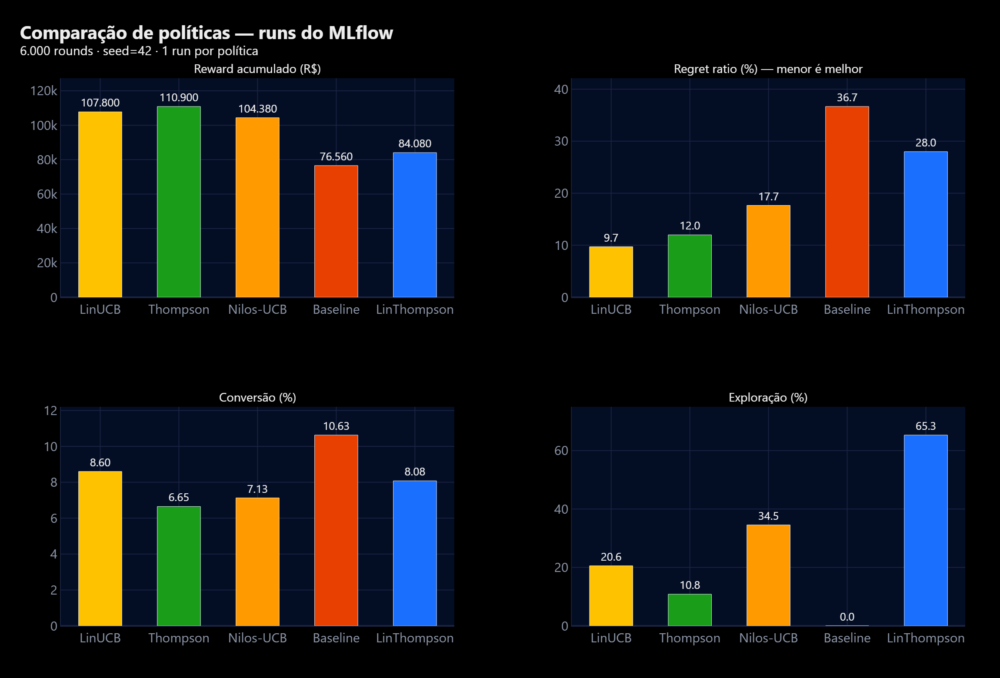
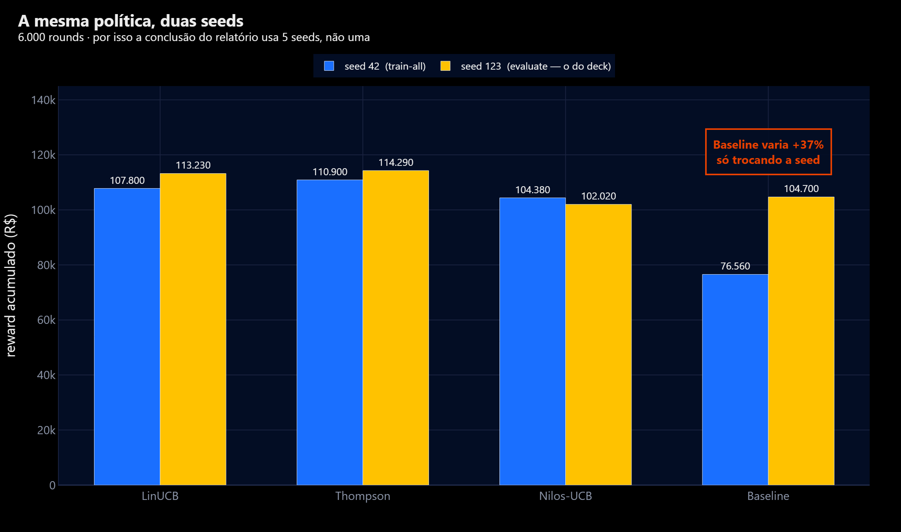

<div align="center">

# 📈 Guia do MLflow — Adaptive Offers Platform

Todas as formas de acessar os experimentos rastreados, da UI web ao terminal.

</div>

---

## 0. O essencial em 15 segundos

```powershell
# na raiz do projeto, com o .venv ativado
$env:MLFLOW_ALLOW_FILE_STORE='true'
mlflow ui --backend-store-uri file:./mlruns --registry-store-uri file:./mlruns --port 5001
```

Abra **http://localhost:5001** → clique na aba **`Model training`** → **Runs**.

> ⚠️ **Três coisas que confundem todo mundo na primeira vez** — leia antes da gravação:
> 1. A porta é **5001**, não a 5000 (a 5000 costuma estar ocupada no Windows).
> 2. Clique em **`Model training`**, **não** em `GenAI`. A visão GenAI exige backend
>    SQL e fica **vazia** com o *file store* — isso é esperado, não é bug.
> 3. A UI leva **15 a 40 segundos** para subir. Espere o `Uvicorn running` aparecer
>    no terminal antes de abrir o navegador, senão você vê uma página de erro.

---

## 1. Por que `MLFLOW_ALLOW_FILE_STORE=true`?

O MLflow 3.x colocou o *file store* local em "modo de manutenção" e **levanta exceção
por padrão**. Como este projeto usa `file:./mlruns` (sem servidor de banco), a variável
faz o opt-in explícito. Ela já é setada automaticamente por:

- `src/adaptive_offers/tracking.py` (todo `train`/`evaluate` do CLI);
- `scripts/mlflow_report.py`;
- `start.ps1` e `VER-MLFLOW.bat`.

Você só precisa exportá-la à mão quando chamar o binário `mlflow` diretamente.

---

## 2. As 6 formas de acessar

### Forma 1 — UI web (a da demonstração)

```powershell
$env:MLFLOW_ALLOW_FILE_STORE='true'
mlflow ui --backend-store-uri file:./mlruns --registry-store-uri file:./mlruns --port 5001
```

Na UI dá para: ordenar por métrica, selecionar 2+ runs e clicar **Compare**
(gráfico paralelo), filtrar por `params.policy`, e baixar CSV.

### Forma 2 — Duplo-clique (sem terminal)

`VER-MLFLOW.bat`, na pasta **acima** do projeto. Já mata processo antigo na 5001,
ativa o `.venv`, seta a variável e sobe a UI.

### Forma 3 — Terminal, instantâneo (`scripts/mlflow_report.py`)

Não sobe servidor nenhum — imprime na hora. **É a forma mais segura para gravar**,
porque não depende de esperar a UI subir.

```powershell
python scripts\mlflow_report.py                  # todos os runs, por reward
python scripts\mlflow_report.py --compare        # melhor run de CADA política
python scripts\mlflow_report.py --policy linucb  # filtra uma política
python scripts\mlflow_report.py --top 3          # os 3 melhores
python scripts\mlflow_report.py --run-id <id>    # params + métricas de um run
```

Saída de `--compare`:

```
run                 política        horizon   reward        regret    conversão   exploração
---------------------------------------------------------------------------------------------
linucb-v1           linucb          20000     370.450       6.0%      8.6%        18.3%
thompson-v1         thompson        20000     362.770       10.3%     6.4%        5.2%
nilos_ucb-v1        nilos_ucb       20000     351.770       12.3%     6.7%        17.5%
baseline-v1         baseline        20000     244.320       36.8%     10.2%       0.0%

Campeão por reward: linucb (370.450) · menor regret: linucb
```

### Forma 4 — API Python direta

> 💡 **Aspas no PowerShell**: use **aspas simples por fora** e duplas dentro do
> Python. O PowerShell **não** processa `\"` aninhado como o bash — o comando
> quebra com `SyntaxError: '(' was never closed`.

```powershell
# contagem de runs
python -c 'import mlflow; mlflow.set_tracking_uri("file:./mlruns"); print(mlflow.search_runs(experiment_names=["adaptive-offers"]).shape[0], "runs")'
```

Para qualquer consulta mais longa, prefira um arquivo `.py` a um one-liner:

```python
import os
os.environ["MLFLOW_ALLOW_FILE_STORE"] = "true"
import mlflow

mlflow.set_tracking_uri("file:./mlruns")

df = mlflow.search_runs(
    experiment_names=["adaptive-offers"],
    filter_string="params.policy = 'linucb'",     # sintaxe de filtro do MLflow
    order_by=["metrics.cumulative_reward DESC"],
    max_results=5,
)
print(df[["tags.mlflow.runName", "metrics.cumulative_reward", "metrics.regret_ratio"]])
```

Filtros úteis (`filter_string`):

| Objetivo | Filtro |
|---|---|
| Uma política | `params.policy = 'linucb'` |
| Horizonte específico | `params.horizon = '6000'` |
| Reward acima de um piso | `metrics.cumulative_reward > 100000` |
| Combinado | `params.policy = 'linucb' and metrics.regret_ratio < 0.1` |

> Todo `param` é **string** no MLflow (por isso `'6000'` entre aspas); métricas são
> numéricas.

### Forma 5 — Gerar runs novos ao vivo

Bom momento de gravação: rode e mostre os runs aparecendo na UI ao dar refresh.

```powershell
adaptive-offers train-all --horizon 6000     # 1 run por política (~50 s)
adaptive-offers train --policy linucb --horizon 6000 --seed 7   # 1 run só
```

### Forma 6 — Docker (stack inteira)

```bash
docker compose up --build
```

---

## 2.1 Trocar a porta (usar a 5000, por exemplo)

A porta é só um argumento — **qualquer porta livre serve**:

```powershell
$env:MLFLOW_ALLOW_FILE_STORE='true'
mlflow ui --backend-store-uri file:./mlruns --registry-store-uri file:./mlruns --port 5000
```

Antes, confira se a porta está livre:

```powershell
# quem está ouvindo na 5000?
Get-NetTCPConnection -LocalPort 5000 -State Listen -ErrorAction SilentlyContinue |
  ForEach-Object { Get-Process -Id $_.OwningProcess | Select-Object Id, ProcessName, Path }

# nada impresso = porta livre

# se estiver ocupada e você quiser liberar:
Get-NetTCPConnection -LocalPort 5000 -State Listen |
  ForEach-Object { Stop-Process -Id $_.OwningProcess -Force }

# a porta está reservada pelo Windows? (Hyper-V/Docker reservam faixas)
netsh interface ipv4 show excludedportrange protocol=tcp
```

> ⚠️ **Mas prefira ficar na 5001.** O deck (slide 10), o README, o `start.ps1`,
> o `stop.ps1` e o `VER-MLFLOW.bat` **já apontam para 5001**. Mudar para 5000
> significa alterar todos esses lugares — e a 5000 é justamente a porta que já
> deu conflito nesta máquina (é um alvo comum de Docker Desktop, Flask e
> serviços do Windows, que podem reivindicá-la a qualquer momento).
>
> Se mesmo assim quiser padronizar na 5000, troque nestes arquivos:
> `start.ps1`, `VER-MLFLOW.bat` (pasta externa), `README.md` §5 e §5.1,
> `COMECE-AQUI.md`, `docs/roteiro-gravacao.md` e o **slide 10** do PPTX
> (via `scripts/sync_pptx_numbers.py`).

---

## 2.2 Análise dos experimentos — o que os runs mostram

> 🖼️ Os gráficos abaixo são gerados **direto do `mlruns/`** por
> `python scripts\build_mlflow_charts.py` (nada de captura de tela: se os runs
> mudarem, os gráficos mudam junto). Eles também estão no deck, nos **slides 21 e 22**.

### A descoberta principal: converter mais ≠ faturar mais


O **Baseline tem a maior taxa de conversão de todas (10,63%) e o menor valor
acumulado (R$ 76.560)**. O LinUCB converte **menos** (8,60%) e entrega **+41% de
valor** (R$ 107.800).

Isso não é um paradoxo — é exatamente a tese do projeto. O baseline é guloso e
empurra quase tudo para a oferta mais fácil de vender, convertendo em volume;
mas ignora o contexto e queima as decisões de maior valor esperado. É a razão de
a recompensa ser **ponderada por margem** (`value = P(conversão) × margem`) em vez
de otimizar cliques.

### Comparação das métricas-chave



| Leitura | Evidência |
|---|---|
| Explorar se paga | LinUCB explora ~21% e tem o **menor regret (9,7%)**; o Baseline explora **0%** e tem o **maior (36,7%)** |
| Exploração demais custa caro | LinThompson explora **65,3%** e fica em último em valor (R$ 84.080) — o extremo oposto do baseline |
| Conversão não ranqueia valor | O Baseline lidera em conversão e é o pior em reward |

### Por que o relatório não decide com uma seed



Trocando **apenas a seed**, o Baseline salta de R$ 76.560 para R$ 104.700 —
uma variação de **+37%**. As políticas adaptativas variam bem menos. É por isso
que a conclusão de `reports/technical-report.md` usa **5 seeds**: na média o
LinUCB lidera com **CV de 2,97%**, contra **20,2%** do baseline.

> ⚠️ **Atenção ao seed ao comparar com o deck.** Estes gráficos usam
> **seed=42** (runs do `train-all`). O **slide 09**, o README §9 e o
> `evaluation_report.json` usam **seed=123** (run do `evaluate`). Os dois recortes
> são válidos e reprodutíveis — mas **não são intercambiáveis**, e por isso todo
> gráfico traz o seed no subtítulo.

---

## 3. O que está registrado em cada run

| Tipo | Chaves |
|---|---|
| **params** | `policy`, `horizon`, `version` |
| **metrics** | `cumulative_reward`, `reward_per_1k`, `cumulative_regret`, `regret_per_1k`, `regret_ratio`, `conversion_rate`, `exploration_rate`, `rounds`, `delayed_fraction`, `seed` |
| **tags** | `policy`, `stage`, `mlflow.runName`, `mlflow.user`, `mlflow.source.*` |

> 📦 **A aba `Artifacts` de cada run fica vazia — isso é intencional.** O MLflow
> aqui rastreia **experimentos** (params/métricas/tags). O modelo serializado e o
> versionamento de política vivem no **registry próprio** do projeto:
> `artifacts/policies/<versão>/policy.pkl` + `metadata.json` (com hash de conteúdo)
> e o ponteiro ativo em `artifacts/policies/registry.json`. Ver
> [`mlops-lifecycle.md`](mlops-lifecycle.md) §3.

---

## 4. Onde ficam os dados

```
mlruns/
├── 0/                        # experimento "Default" (vazio)
├── 385302374920923964/       # experimento "adaptive-offers"
│   ├── meta.yaml
│   └── <run_id>/
│       ├── meta.yaml         # run_name, status, artifact_uri
│       ├── params/           # 1 arquivo por param
│       ├── metrics/          # 1 arquivo por métrica
│       ├── tags/
│       └── artifacts/        # vazio (ver nota acima)
└── models/                   # registry do MLflow (não usado — ver §3)
```

`mlruns/` está no `.gitignore`: experimentos são **estado local**, não código.

---

## 5. Troubleshooting

| Sintoma | Causa | Solução |
|---|---|---|
| `MlflowException: file store ... maintenance mode` | falta o opt-in | `$env:MLFLOW_ALLOW_FILE_STORE='true'` |
| Página em branco / "não conecta" | UI ainda subindo | espere o `Uvicorn running` (até 40 s) |
| Aba `GenAI` vazia | precisa de backend SQL | use a aba **`Model training`** |
| `Address already in use` na 5001 | processo antigo | `Get-NetTCPConnection -LocalPort 5001 -State Listen \| ForEach-Object { Stop-Process -Id $_.OwningProcess -Force }` |
| Runs não aparecem | `mlflow ui` rodando de outra pasta | rode da **raiz do projeto** (o `file:./mlruns` é relativo) |
| Aba `Artifacts` com erro de caminho | `mlruns/` copiado/movido de outra pasta | os caminhos absolutos ficam gravados no `meta.yaml`; reescreva-os ou apague `mlruns/` e rode `adaptive-offers train-all` |
| Nenhum run em lugar nenhum | nunca treinou | `adaptive-offers train-all --horizon 6000` |

> 🔧 O caso do **caminho absoluto** já aconteceu neste projeto: a pasta foi
> renomeada de `...grupo-64` para `...grupo-74` e todo `artifact_uri` gravado no
> `meta.yaml` continuou apontando para o caminho velho. Se acontecer de novo,
> um *find & replace* do caminho antigo pelo novo dentro de `mlruns/` resolve.

---

<div align="center">

[⬅ Voltar ao índice da documentação](README.md) · [🏠 README principal](../README.md)

</div>
